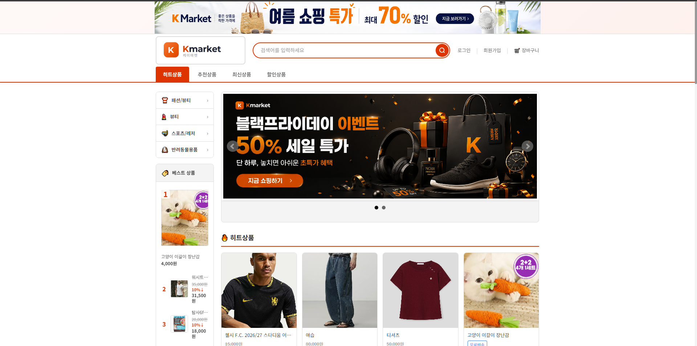
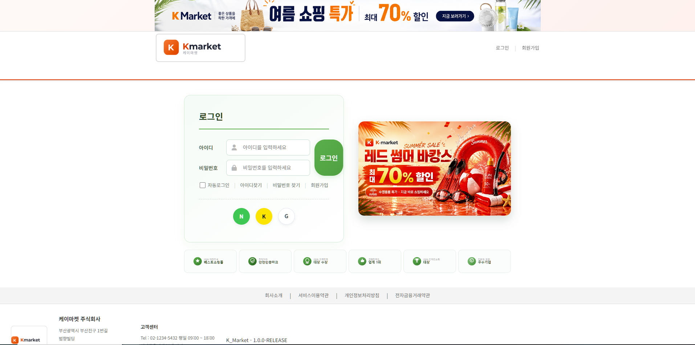
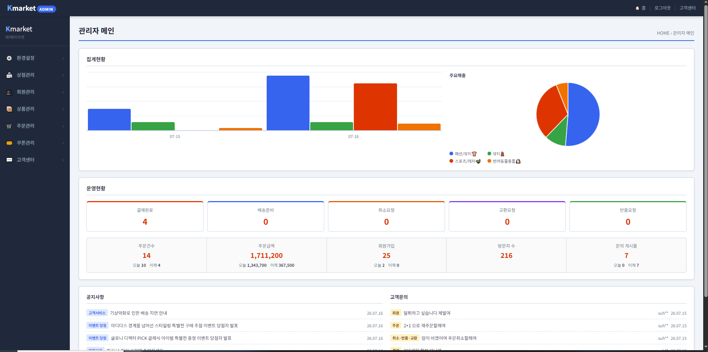
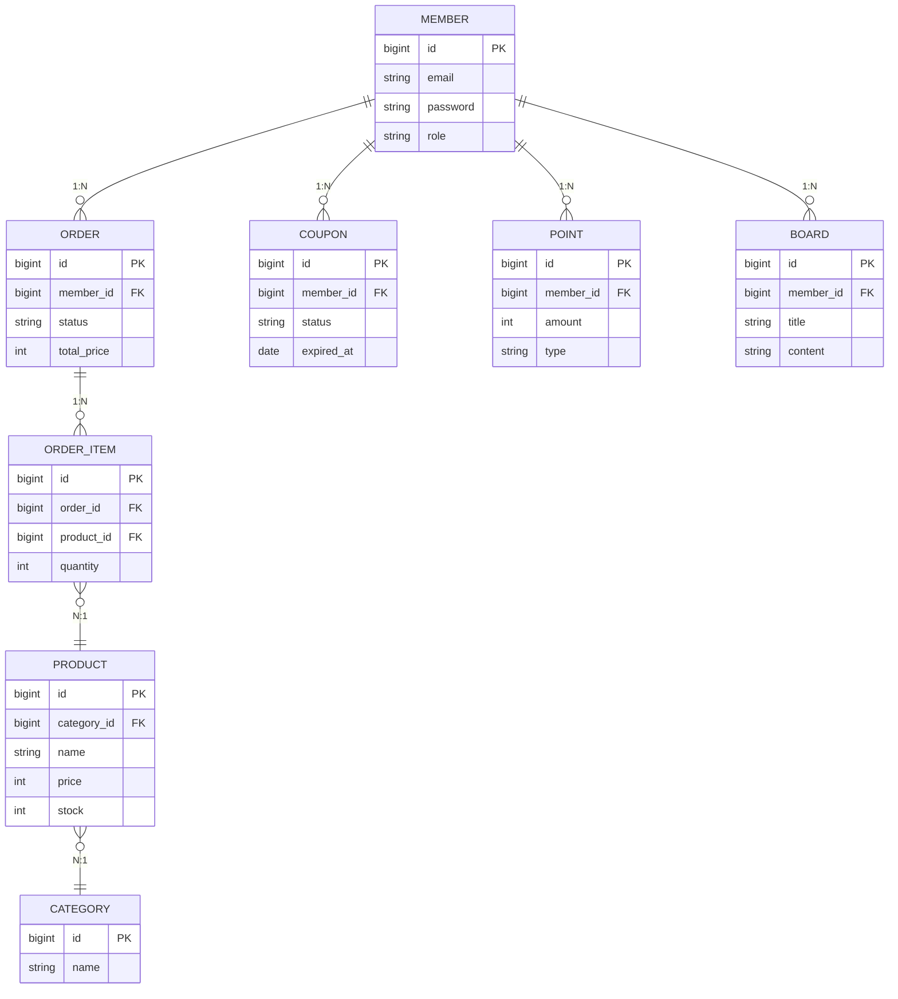

# K_Market
<div align="center">

# 🛍️ K-Market

### 좋은 상품을 착한 가격에, K-Market 이커머스 플랫폼

**화면 구성 2주 + 백엔드 개발 2주 통합 일정**
`2026.06.24 ~ 2026.07.16`


</div>

---

## 🖼️ 화면 미리보기

<div align="center">

| 메인 페이지 | 로그인 페이지 | 관리자 대시보드 |
|:---:|:---:|:---:|
|  |  |  |

</div>

---

## 📌 프로젝트 개요

**K-Market**은 회원(일반/소셜 로그인), 상품/주문, 관리자, 고객센터, 포인트/쿠폰 기능을 통합한 이커머스 플랫폼입니다.
4인 팀이 **4주간** 화면 구성과 백엔드 개발을 병행합니다.

| 항목 | 내용 |
|:---|:---|
| 📅 **개발 기간** | 2026.06.24 ~ 07.16 (총 4주) |
| 🎨 **UI/UX** | 화면 구성 2주 (06.24 ~ 07.05) |
| ⚙️ **백엔드** | 개발 2주 (07.06 ~ 07.16) |
| 👥 **팀 구성** | 4명 역할 분담 (A / B / C / D) |

---

## 👥 팀 구성 및 역할 분담

| 이름 | 역할 | 담당 화면 | 담당 백엔드 |
|:---:|:---:|:---|:---|
| 🧑‍💻 **민찬 (A)** | 회원/인증 | 회원가입 · 로그인 · 마이페이지 | 로그인 / 회원 |
| 🧑‍🔧 **현호 (B)** | 상품/주문 | 관리자 페이지 전체 | 상품 / 주문 |
| 👩‍💼 **유원 (C)** | 관리자/게시판 | 고객센터 | 관리자 운영 / 게시판 |
| 🧑‍🎨 **수현 (D)** | 포인트/쿠폰 | 메인 / 상품 / 정책 | 포인트 / 쿠폰 / 주문 |

---

## 🗓️ 개발 일정 (간트 차트)

| 담당자 | 6/24~30 | 7/1~5 | 7/6~9 | 7/10 | 7/13~14 | 7/15~16 |
|:---|:---|:---|:---|:---|:---|:---|
| 민찬 (A) | 회원 화면 | 회원 화면 | 인증·DB | 통합 점검 | 통합 테스트 | 🚀 배포 |
| 현호 (B) | 관리자 화면 | 관리자 화면 | 상품·주문 | 통합 점검 | 통합 테스트 | 🚀 배포 |
| 유원 (C) | CS 화면 | CS 화면 | 게시판·파일 | 통합 점검 | 통합 테스트 | 🚀 배포 |
| 수현 (D) | 메인·상품 화면 | 메인·상품 화면 | 포인트·쿠폰 | 통합 점검 | UX QA | 🚀 배포 |
| **전체** | UI/UX 설계 | UI/UX 완료 | DB·API 구현 | 코드 리뷰 | 버그 수정·QA | **최종 배포** |

---

## 🏗️ 프로젝트 아키텍처 (1주차 개발 스케줄)

> `2026-07-06 ~ 2026-07-16` (평일만 작업) · 매일 오후 마지막 30분 데일리 싱크

<details>
<summary><b>🔵 A · 로그인/회원</b> (클릭하여 펼치기)</summary>

| Day1 (7/6) | Day2 (7/7) | Day3 (7/8) | Day4 (7/9) | Day5 (7/10) | Day6~8 (7/13~15) |
|:---|:---|:---|:---|:---|:---|
| member→seller 스캐폴딩 (오전 공유) | 인증 미들웨어(JWT/세션) 완성·공유 | 회원가입/로그인/탈퇴, 판매자·회사소개 API | 마이페이지 API, 권한 체크 보강 | 예외처리 + 단위테스트 | API 명세 초안 |

</details>

<details>
<summary><b>🟢 B · 상품/주문</b> (클릭하여 펼치기)</summary>

| Day1 (7/6) | Day2 (7/7) | Day3 (7/8) | Day4 (7/9) | Day5 (7/10) | Day6~8 (7/13~15) |
|:---|:---|:---|:---|:---|:---|
| category→product→옵션 5종 →cart→order→order_item | cart/order/order_item 마무리 | 상품 등록·조회 Service | 상품 CRUD·검색, 옵션/조합, 장바구니 API | claim(반품/교환) API | D와 포인트·쿠폰 연동 협업, 재고/옵션/결제 예외처리, 단위테스트, API 명세 |

</details>

<details>
<summary><b>🩷 C · 관리자/게시판</b> (클릭하여 펼치기)</summary>

| Day1 (7/6) | Day2 (7/7) | Day3 (7/8) | Day4 (7/9) | Day5 (7/10) | Day6~8 (7/13~15) |
|:---|:---|:---|:---|:---|:---|
| file 최우선 완료·공유 → 나머지 5개 | 파일업로드 Service(공통 API) 완성·공유 | 환경설정, 배너 CRUD, 게시판 CRUD API | 관리자 통합조회 API 뼈대 | board_reply 마무리 | 업로드 용량/확장자, 배너 유효성 검증, API 명세 |

</details>

<details>
<summary><b>🟠 D · 포인트/쿠폰/주문</b> (클릭하여 펼치기)</summary>

| Day1 (7/6) | Day2 (7/7) | Day3 (7/8) | Day4 (7/9) | Day5 (7/10) | Day6~8 (7/13~15) |
|:---|:---|:---|:---|:---|:---|
| point→coupon→coupon_issue, board→board_reply→review→claim | 포인트 적립/차감, 쿠폰 발급/검증 | 포인트 조회, 쿠폰 발급/다운로드/사용, 정책 API | B와 포인트·쿠폰 연동 테스트 | 주문완료 연동 완성 | 포인트/쿠폰 만료·중복방지, 게시판 권한 검증, 예외 케이스 |

</details>

> ⚠️ **선행 완료 필수**: `member/seller(A)`, `file(C)`는 Day1 오전 중 완료 후 공유 → 다른 담당자 FK 매핑 지연 방지
> 🔗 **공통 모듈**: 인증(A) · 파일업로드(C) · 포인트/쿠폰(D) API는 완성 즉시 팀 채널 공유, 이후 다른 사람은 호출만 함
> 🤝 **핵심 협업 지점**: Day6~7 B ↔ D (주문 완료 로직에 포인트/쿠폰 반영), 인터페이스는 Day2~3에 미리 합의 권장

---

## 🗺️ 정보 구조 (IA)

```
K-Market
├── 헤더
│   ├── 로그인
│   ├── 회원가입
│   ├── 장바구니
│   └── 검색
├── GNB (히트 / 추천 / 최신 / 할인상품)
│   ├── 히트상품
│   ├── 추천상품
│   ├── 최신상품
│   └── 할인상품
├── 카테고리 사이드메뉴
│   ├── 패션/뷰티
│   ├── 뷰티
│   ├── 스포츠/레저
│   └── 반려동물용품
├── 메인 배너
│   ├── 이벤트 슬라이드 (블랙프라이데이 등)
│   └── 배너 CTA (지금 쇼핑하기)
├── 히트상품 목록
│   ├── 상품 카드 (이미지·가격·할인율)
│   └── 베스트 상품 TOP 리스트
└── 관리자페이지
    ├── 대시보드
    └── 상품 / 주문 / 회원 관리
```

---

## 🧩 ERD (Entity Relationship)



> **핵심 관계**: 회원은 여러 주문·쿠폰·포인트·게시글을 보유(1:N) · 주문은 여러 주문상품으로 구성(1:N) · 주문상품과 상품은 다대일 · 상품과 카테고리는 다대일 관계

---

## 🎬 프로젝트 시연

| 담당 | 기능 |
|:---|:---|
| 🧑‍💻 **회원/인증 (민찬)** | 회원가입·로그인(일반/소셜), 이메일 인증, 비밀번호 관리, 마이페이지(정보수정·주문내역·리뷰), 판매자 등록 |
| 🧑‍🔧 **상품/주문 (현호)** | 상품 카테고리·옵션 관리, 등록/수정/삭제, 장바구니·실시간 수량 관리, 주문 생성·상태 추적 |
| 👩‍💼 **관리자/게시판 (유원)** | 관리자 대시보드(통계·현황), 회원/상품/주문 통합 관리, 고객센터 CRUD, 파일업로드 API |
| 🧑‍🎨 **포인트/쿠폰 (수현)** | 포인트 적립/사용/조회, 쿠폰 생성/발급/사용 자동화, 리뷰·평점 관리, 클레임(취소/반품/교환) 워크플로우 |

---

## ✅ 프로젝트 마무리

K-Market 프로젝트는 4주간 4인 팀이 협력하여 **화면 구성 → 백엔드 개발 → 통합 테스트 → 배포**까지 완수합니다.

- 📋 **일정 요약**: UI/UX 2주 + 백엔드 2주
- 👥 **역할 분담**: 민찬 · 현호 · 유원 · 수현
- 🚀 **최종 목표**: 2026.07.16 배포 완료

<div align="center">

---

Made with ❤️ by **K-Market Team**

</div>
