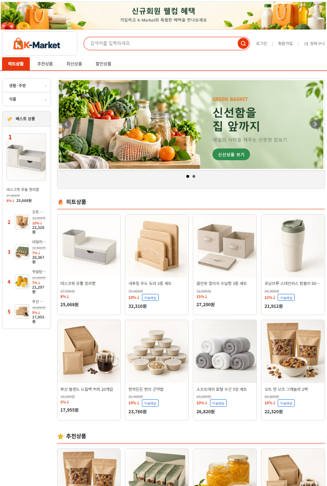
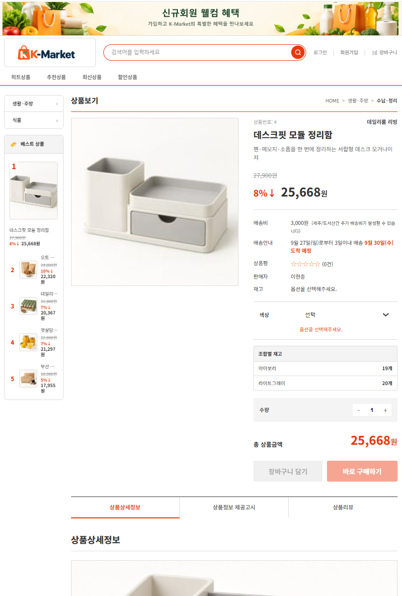
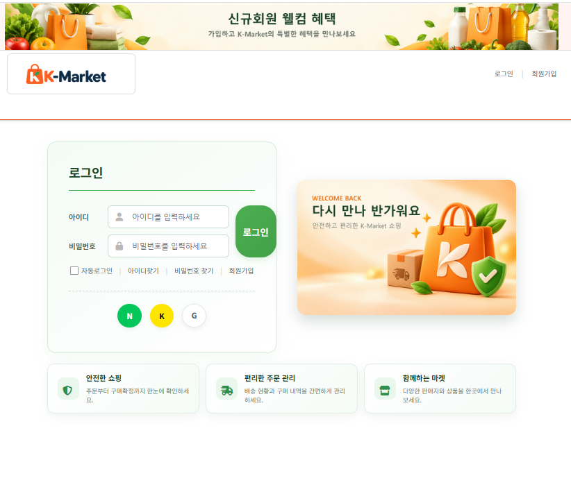
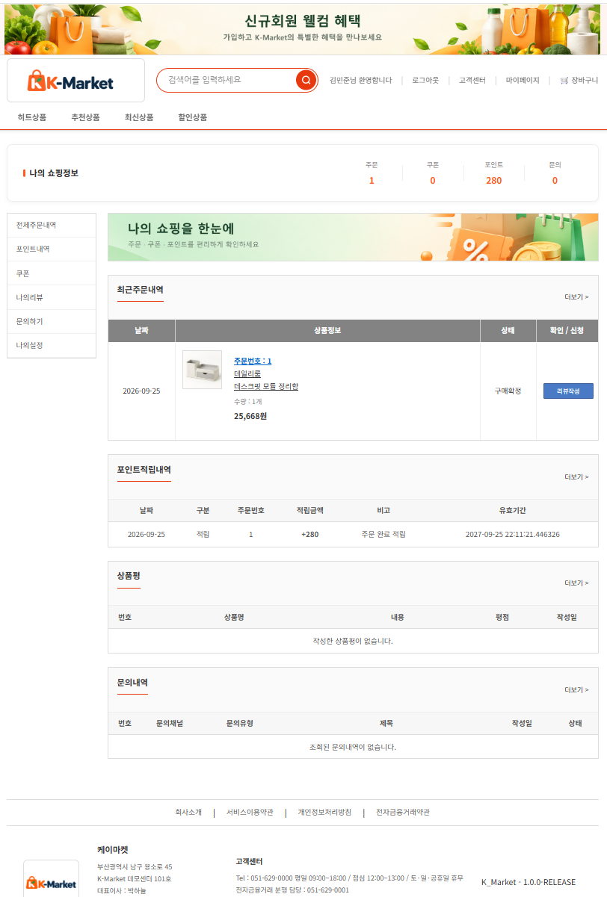
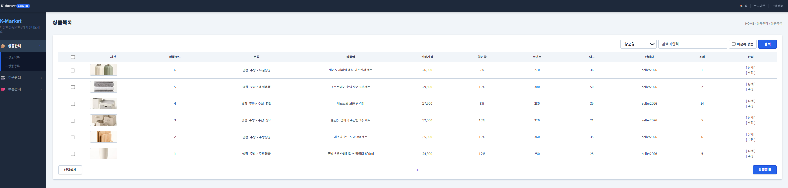
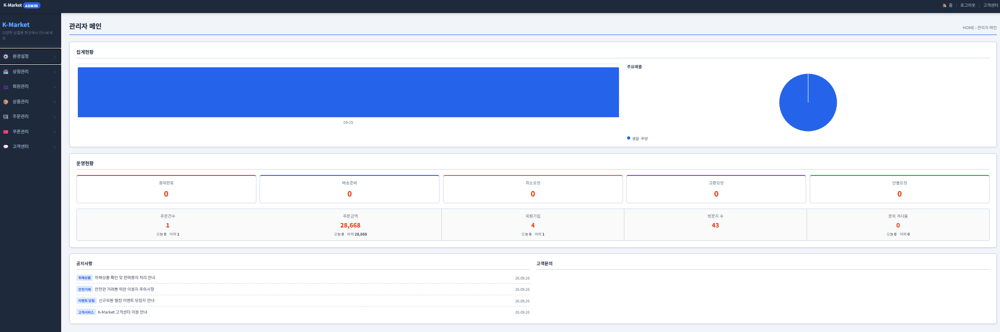
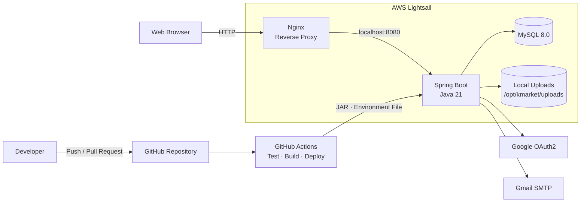
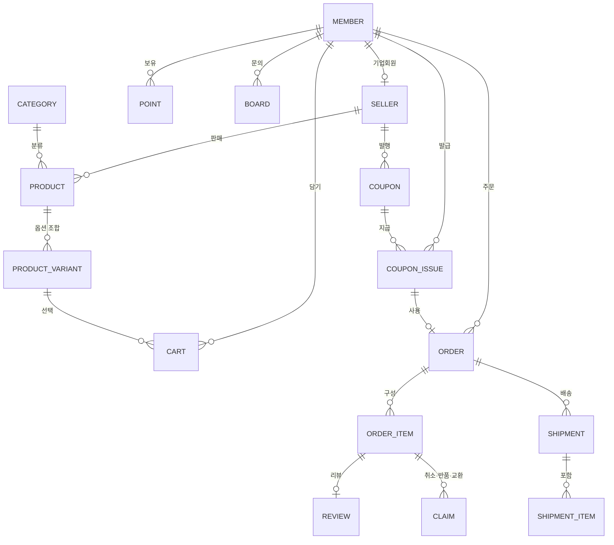

<p align="center">
  
</p>

<div align="center">

> **상품 등록부터 주문·배송·구매확정까지 이어지는 멀티 판매자 쇼핑몰**

일반회원, 기업회원, 관리자의 역할을 분리하고<br>
상품·주문·쿠폰·포인트·고객센터와 사이트 운영 기능을 통합했습니다.

[서비스 바로가기](http://52.78.122.126/K_Market/) · [API 문서](./docs/API.md) · [데이터베이스 설정](./database/README.md)

</div>

---

## 🖥 서비스 미리보기

| 메인 페이지 | 상품 상세 |
|:---:|:---:|
|  |  |
| **로그인** | **일반회원 마이페이지** |
|  |  |
| **기업회원 상품관리** | **관리자 대시보드** |
|  |  |

---

## 📖 프로젝트 소개

K-Market은 여러 기업회원이 상품을 판매하고 일반회원이 상품을 탐색·구매할 수 있는 이커머스 플랫폼입니다. 단순 상품 CRUD를 넘어 주문 이후 배송, 구매확정, 리뷰, 취소·반품·교환 흐름과 관리자 운영 기능까지 하나의 서비스로 연결했습니다.

- 카테고리와 상품 옵션 조합을 이용한 상품·재고 관리
- 장바구니, 주문, 쿠폰, 포인트를 결합한 구매 흐름
- 운송장 등록 이후 배송 상태 자동 전환 및 구매확정
- 일반회원·기업회원·관리자 역할별 화면과 접근 범위 분리
- 관리자 사이트 설정을 통한 로고·배너·약관·고객센터 콘텐츠 관리
- Google OAuth2 로그인과 이메일 인증 기반 회원 기능

| 항목 | 내용 |
| --- | --- |
| 개발 기간 | 2026.06.24 ~ 2026.07.16 |
| 개발 형태 | 4인 팀 프로젝트, 이후 포트폴리오 배포 및 기능 보완 |
| 애플리케이션 버전 | `1.0.0-RELEASE` |
| 운영 환경 | AWS Lightsail · Nginx · MySQL · GitHub Actions |

---

## 🚀 데모

| 구분 | 주소 |
| --- | --- |
| Live Demo | [K-Market 서비스](http://52.78.122.126/K_Market/) |
| Notion | 포트폴리오 문서 작성 후 연결 예정 |

### 데모 계정

| 권한 | 아이디 | 비밀번호 |
| --- | --- | --- |
| 일반회원 | `member2026` | `Kmarket2026!` |
| 기업회원 | `greenbasket` | `Kmarket2026!` |
| 기업회원 | `seller2026` | `Kmarket2026!` |

> 관리자 계정은 운영 데이터 보호를 위해 공개하지 않습니다. Google 로그인은 현재 OAuth 테스트 모드로 운영합니다.

---

<details>
<summary><strong>🛠 기술 스택</strong></summary>

### Frontend

- HTML5 · CSS3 · JavaScript
- Thymeleaf
- jQuery · bxSlider

### Backend

- Java 21
- Spring Boot 3.5.15
- Spring MVC · Spring Security
- Spring Data JPA · MyBatis
- Spring Validation · Spring Mail
- Google OAuth2 Client
- Gradle

### Database & File

- MySQL 8.0
- 서버 로컬 파일 시스템(`/opt/kmarket/uploads`)

### Infrastructure

- AWS Lightsail
- Nginx 리버스 프록시
- GitHub Actions
  - Pull Request: 테스트 및 실행 JAR 빌드
  - `main` push: JAR·운영 환경 파일 전송 후 애플리케이션 재기동

### Tools

- Git · GitHub
- IntelliJ IDEA · MySQL Workbench
- Notion

</details>

---

<details>
<summary><strong>🏗 시스템 아키텍처</strong></summary>


```mermaid
flowchart LR
    Developer[Developer] -->|Push / Pull Request| GitHub[GitHub Repository]
    GitHub --> Actions[GitHub Actions<br/>Test · Build · Deploy]
    User[Web Browser] -->|HTTP| Nginx

    subgraph Lightsail[AWS Lightsail]
        Nginx[Nginx<br/>Reverse Proxy]
        App[Spring Boot<br/>Java 21]
        DB[(MySQL 8.0)]
        Uploads[(Local Uploads<br/>/opt/kmarket/uploads)]
        Nginx -->|localhost:8080| App
        App --> DB
        App --> Uploads
    end

    Actions -->|JAR · Environment File| App
    App --> Google[Google OAuth2]
    App --> Gmail[Gmail SMTP]
```

운영 비밀정보는 저장소에 넣지 않고 GitHub Actions Secrets에서 환경변수 파일로 전달합니다. 업로드 파일은 배포 JAR과 분리해 서버 디렉터리에 보존합니다.

</details>

---

<details>
<summary><strong>🔐 사용자 권한</strong></summary>

| 권한 | 주요 기능 |
| --- | --- |
| 비회원 | 메인·상품·회사소개·공지사항·FAQ 조회, 회원가입 및 로그인 |
| 일반회원 | 장바구니, 주문, 쿠폰·포인트, 배송조회, 구매확정, 리뷰, 1:1 문의 |
| 기업회원 | 자사 상품·재고·주문·배송·매출·쿠폰 관리 |
| 관리자 | 회원·기업·상품·주문·쿠폰·CS·배너·약관·사이트 설정 통합 관리 |

기업회원은 승인된 계정만 판매자 관리 영역을 사용할 수 있으며, 자신이 등록한 쿠폰과 발급 내역만 조회할 수 있습니다. 관리자는 전체 운영 데이터를 조회합니다.

</details>

---

<details open>
<summary><strong>✨ 주요 기능</strong></summary>

### 👤 일반회원

- 일반회원 가입, 이메일 인증, 로그인, 아이디·비밀번호 찾기
- Google OAuth2 로그인 및 신규 소셜 회원 추가정보 등록
- 카테고리·키워드·정렬 조건을 이용한 상품 탐색
- 상품 옵션 선택, 장바구니 담기, 수량 변경 및 주문
- 주문 시 보유 쿠폰과 포인트 적용
- 주문·배송 상태 조회, 구매확정, 취소·반품·교환 신청
- 구매확정 상품 리뷰 작성
- 보유 쿠폰·포인트 및 1:1 문의 내역 조회

### 🏢 기업회원

- 기업회원 가입 및 관리자 승인 상태 확인
- 자사 상품, 상품 이미지, 고시정보, 옵션 조합과 재고 관리
- 주문 상품 조회 및 운송장 등록
- 판매 현황과 매출 조회
- 자사 상품 할인 또는 배송비 무료 쿠폰 생성
- 자사 상품 첫 구매확정 고객에게 발급되는 쿠폰 관리

### 🛠 관리자

- 회원 상태·등급 및 기업 승인 관리
- 전체 상품·주문·배송·취소·반품·교환 관리
- 전체 주문 할인·배송비 무료 쿠폰 생성 및 발급 내역 관리
- 카테고리, 배너, 약관, 사이트 버전과 기본정보 관리
- 공지사항·FAQ·1:1 문의 답변 관리
- 메인 운영 통계와 매출 현황 조회

### 🎟 쿠폰 자동 지급

- 관리자가 만든 활성 쿠폰은 일반회원 가입 완료 시 지급
- 기업회원이 만든 활성 쿠폰은 해당 기업 상품의 첫 구매확정 시 지급
- 동일 회원에게 동일 쿠폰이 중복 발급되지 않도록 애플리케이션과 DB 제약으로 방지
- 쿠폰 지급 결과를 회원가입·구매확정 완료 메시지로 안내

</details>

---

<details>
<summary><strong>🔄 주요 서비스 흐름</strong></summary>

### 구매 및 배송

```text
상품 탐색 → 옵션 선택 → 장바구니/바로구매
→ 배송지·결제수단·쿠폰·포인트 입력
→ 주문 완료 → 판매자 운송장 등록
→ 배송중 → 배송완료 → 구매확정 → 리뷰 작성
```

### 취소·반품·교환

```text
주문상품 선택 → 사유 및 수량 입력 → 클레임 신청
→ 관리자 확인 → 승인/거절 → 필요 시 교환 재배송
```

### 기업 쿠폰

```text
기업회원 쿠폰 생성 → 고객의 해당 기업 첫 구매확정
→ 발급 조건과 중복 여부 확인 → 쿠폰함 지급 → 메시지 안내
```

</details>

---

<details>
<summary><strong>🗄 데이터베이스 구성</strong></summary>

MySQL 8.0 기준 28개 테이블로 구성했습니다. 전체 실행 방법과 관리 원칙은 [database/README.md](./database/README.md), 신규 환경용 DDL은 [database/schema-mysql.sql](./database/schema-mysql.sql)에서 확인할 수 있습니다.


```mermaid
erDiagram
    MEMBER ||--o| SELLER : "기업회원"
    MEMBER ||--o{ CART : "담기"
    MEMBER ||--o{ ORDER : "주문"
    MEMBER ||--o{ POINT : "보유"
    MEMBER ||--o{ COUPON_ISSUE : "발급"
    MEMBER ||--o{ BOARD : "문의"
    SELLER ||--o{ PRODUCT : "판매"
    SELLER ||--o{ COUPON : "발행"
    CATEGORY ||--o{ PRODUCT : "분류"
    PRODUCT ||--o{ PRODUCT_VARIANT : "옵션 조합"
    PRODUCT_VARIANT ||--o{ CART : "선택"
    ORDER ||--o{ ORDER_ITEM : "구성"
    ORDER ||--o{ SHIPMENT : "배송"
    SHIPMENT ||--o{ SHIPMENT_ITEM : "포함"
    ORDER_ITEM ||--o| REVIEW : "리뷰"
    ORDER_ITEM ||--o{ CLAIM : "취소·반품·교환"
    COUPON ||--o{ COUPON_ISSUE : "지급"
    COUPON_ISSUE ||--o| ORDER : "사용"
```

</details>

---

<details>
<summary><strong>📂 프로젝트 구조</strong></summary>

```text
K-Market
├── src/main/java/org/example/k_market
│   ├── controller       # 화면 및 REST API 요청 처리
│   ├── service          # 회원·상품·주문·쿠폰 등 비즈니스 로직
│   ├── repository       # Spring Data JPA 저장소
│   ├── dao              # MyBatis 매퍼 인터페이스
│   ├── entity           # JPA 엔티티
│   ├── dto              # 요청·응답 및 화면 모델
│   ├── config           # Security·MVC·Clock 설정
│   ├── interceptor      # 로그인·관리자/기업회원 접근 제어
│   ├── security         # Google OAuth2 사용자 처리
│   └── advice           # 공통 모델 및 예외 처리
├── src/main/resources
│   ├── templates        # Thymeleaf 화면
│   ├── static           # CSS·JavaScript·정적 이미지
│   ├── mapper           # MyBatis SQL
│   └── application*.properties
├── src/test             # 애플리케이션·서비스 단위 테스트
├── database             # MySQL DDL과 초기 관리자 예시
├── docs                 # API 문서
└── .github/workflows    # CI/CD 워크플로
```

</details>

---

<details>
<summary><strong>👨‍💻 팀 구성</strong></summary>

| 이름 | 주요 담당 영역 |
| --- | --- |
| 민찬 | 회원가입·로그인·회원·마이페이지 |
| 현호 | 상품·주문 및 관리자 상품 화면 |
| 유원 | 관리자 운영·고객센터·게시판 |
| 수현 | 메인·상품 UI, 포인트·쿠폰·주문 연동 및 포트폴리오 배포 보완 |

기능 단위 브랜치와 Pull Request를 사용하고, `main` 병합 시 GitHub Actions로 운영 서버에 자동 배포합니다.

</details>

---

<details>
<summary><strong>🔥 트러블슈팅</strong></summary>

### 업로드 파일과 DB 파일명의 인코딩 불일치

- **문제:** Windows에서 옮긴 한글 파일명이 Linux 서버에서 깨져 DB 경로와 실제 파일명이 일치하지 않았습니다.
- **해결:** DB에 저장된 UUID 접두어로 파일을 식별해 서버 파일명을 정규화하고, 업로드 디렉터리를 배포 JAR과 분리했습니다.
- **결과:** 재배포 후에도 상품 이미지가 유지되고 `/files/{id}`를 통해 정상 제공됩니다.

### 역할별 관리자 화면 접근 범위

- **문제:** 관리자와 기업회원이 같은 관리 화면을 사용해 일반회원 접근 차단과 판매자별 데이터 범위 구분이 필요했습니다.
- **해결:** MVC 인터셉터에서 역할과 기업 승인 상태를 확인하고, 기업회원은 상품·주문·쿠폰 영역만 허용했습니다. 목록 쿼리에도 로그인한 판매자 범위를 적용했습니다.
- **결과:** 관리자는 전체 데이터를, 기업회원은 자신의 운영 데이터만 관리합니다.

### 쿠폰 생성과 실제 지급 흐름의 단절

- **문제:** 관리자와 기업회원이 쿠폰을 생성할 수 있었지만 회원에게 자동 지급되는 시점이 없었습니다.
- **해결:** 관리자 쿠폰은 회원가입 완료 시, 기업 쿠폰은 해당 판매자의 첫 구매확정 시 지급하도록 연결했습니다. 기간·발급 수량·중복 발급 여부를 함께 검증합니다.
- **결과:** 쿠폰 생성부터 지급·주문 적용·사용 처리까지 하나의 흐름으로 이어집니다.

### CI/CD 비밀정보와 업로드 파일 분리

- **문제:** 운영 DB·OAuth·메일 설정과 사용자 업로드 파일을 소스 저장소 및 실행 JAR과 분리해야 했습니다.
- **해결:** GitHub Secrets로 실행 환경 파일을 생성하고, 업로드 경로는 `/opt/kmarket/uploads`로 고정했습니다. Actions가 빌드된 JAR만 전송해 프로세스를 재기동합니다.
- **결과:** 비밀정보를 커밋하지 않고 배포할 수 있으며 재배포가 기존 상품 이미지를 덮어쓰지 않습니다.

</details>

---

## ⚠️ 데모 운영 범위

- 현재 서비스는 포트폴리오용 HTTP 고정 IP 환경으로 운영합니다.
- Google OAuth 앱은 테스트 상태이므로 등록된 테스트 사용자만 로그인할 수 있습니다.
- 실제 PG 결제와 택배사 API 대신 내부 주문·배송 상태 흐름을 구현했습니다.
- 업로드 파일은 Lightsail 인스턴스 로컬 디스크에 저장하므로 운영 확장 시 객체 스토리지로 이전할 수 있습니다.
- CSRF 보호와 세부 URL 권한 정책은 공개 운영 전 추가 보강이 필요합니다.

---

<p align="center">
  
</p>
